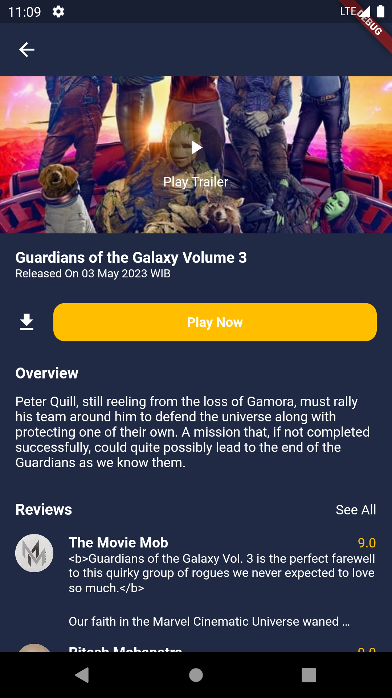

# Simple Movie Flutter Demo App

A demo project which is based on Flutter and build with MVVM and Clear Architecture in mind and singleton using injectable and getit.

The app uses https://www.themoviedb.org REST API to get the data about movies

## Description

This app has home screen for movies and tvs. When user click the detail, it will show the detail and review

## Architecture Overview

## Overview

| Preview Movie     | Preview TV       |
|-------------------|------------------|
|   |  |
|   |  |

## Tests

